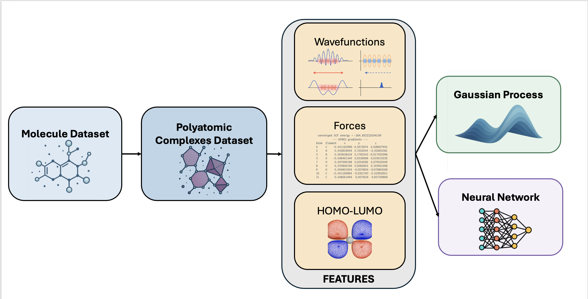

# Summary

Developing robust representations of chemical structures that enable models to learn topological inductive biases is challenging. Polyatomic complexes are a novel learning representation for atomistic systems that addresses this challenge. The representation satisfies numerous structural, geometric, efficiency, and generalizability constraints.

# Statement of Need

Current molecular representations, such as SMILES, SELFIES, or graph-based fingerprints, are limited in their ability to accurately reflect electronic structure and higher-order topological features. Additionally, existing representations in computational chemistry fail to satisfy some non-empty subset of accuracy, generalizability, and efficiency constraints [@khorana2024polyatomiccomplexestopologicallyinformedlearning]. Polyatomic Complexes fill this gap by providing a physics-informed and topologically accurate representation that is general across chemical domains, modular, and compatible with standard ML workflows.

Fundamentally, chemical representations should satisfy the following criteria [@langer2022representations].

1. Invariances: Representations should be invariant under changes in atom indexing and molecular rotation, reflection, and translation [@langer2022representations].
2. Uniqueness: Two systems differing in properties should be mapped to different representations. Systems with equal representations that differ in property induce errors. Uniqueness is necessary and sufficient for reconstruction, up to invariant transformations, of an atomistic system from its representation [@langer2022representations].
3. Continuity and Differentiability: Representations of atomistic systems should be continuous.
and differentiable with respect to atomic coordinates [@langer2022representations]. Moreover, discontinuities work against regularity assumptions of many machine learning models [@khorana2024polyatomiccomplexestopologicallyinformedlearning].
4. Generality: We say a representation of atomistic systems or molecules satisfies generality only if it can encode any atomistic system [@langer2022representations].
5. Efficiency: Essentially, representing atomistic systems should be computationally efficient. Ideally, representations are linear in the number of elements in a molecule, `O(S)`, as is the case with molecular graphs [@KrennGuzikOriginal2020Selfies].
6. Topological Accuracy: Representations are topologically accurate if they can correctly represent the geometry of any molecule or atomistic system. Correctness requires representing the shape, bond-angles, dihedrals/torsion, and electronic structure aspects accurately [@khorana2024polyatomiccomplexestopologicallyinformedlearning].
7. Long-range interactions: The term long-range interactions refers to electrostatic potential energies
between atoms and molecules, with mutual distances ranging from a few tens to a few hundreds Bohr
radii [@LongRangeInteractions]. Representations should be able to account for long-range interactions.
8. Chemical and Physical Informedness: A representation is well-informed by chemistry or physics if it contains information about the chemical properties of each individual atom.

Polyatomic Complexes satisfy all these criteria [@khorana2024polyatomiccomplexestopologicallyinformedlearning].

The software is helpful to researchers in cheminformatics, quantum chemistry, and materials science seeking a theoretically grounded approach to feature generation. Essentially Polyatomic Complexes are an alternative to the other representations common in cheminformatics which do not provide the same theoretical guarantees. 

While widely used, current molecular representations—such as SMILES, SELFIES, molecular graphs, and ECFP fingerprints—often fail to incorporate physically meaningful topological and electronic structure information [@khorana2024polyatomiccomplexestopologicallyinformedlearning; @manolopoulos1992molecular; @rogers2010extended; @krenn2022selfies]. These representations, although computationally efficient, are not designed to satisfy key scientific constraints such as topological accuracy, long-range interactions, and differentiability with respect to atomic coordinates [@langer2022representations; @BhadwalGenSMILES2023; @le2020neuraldecipher].

Polyatomic Complexes address this gap by introducing a general-purpose, and topologically informed representation that integrates smoothly with modern ML pipelines. This fills a critical unmet need in the intersection of chemistry, materials science, and machine learning.

Moreover with the advent of topological deep learning such representations will become increasingly applicable [@zia2024topological]. A classic example of this is Cellular Neural Networks [@khorana2024cwcnncwan] or Cellular Gaussian Processes [@alain2024gaussian] which are compatible with Polyatomic Complexes [@khorana2024polyatomiccomplexestopologicallyinformedlearning].

# Code Contributions and Workflow

The provided code enables researchers to develop effective models for a variety of tasks in cheminformatics and materials science. The code/repository contributions can be summarized as follows:

1. An implementation of the core Polyatomic Complexes representation
2. An easy to use, well documented API for experiments, see the [official documentation](https://rahulkhorana.github.io/PolyatomicComplexes/).
3. Easy integration with existing quantum chemistry libraries such as pyscf [@sun2020recent], and pymatgen [@ong2013python].
4. Well packaged example datasets for baseline performance and benchmarking.

Moreover the Polyatomic Complexes are stratified into different categories depending on usage and experimental need. This is touched upon in the Software Description.

A standard workflow for molecular machine learning using Polyatomic Complexes would look as follows.

The figure above shows the standard pipeline for many molecular machine-learning tasks. Initially, one receives a dataset consisting of both input and output columns. The input is usually a SMILES string [@weininger1988smiles] or material [@jain2020materials]. However, a wide variety of inputs are possible, such as molecular graphs, SEFLIES, and ECFP fingerprints [@manolopoulos1992molecular; @rogers2010extended; @krenn2022selfies]. In the second stage, these input columns containing the molecule are transformed into Polyatomic Complexes. This enables one to compute numerous features ranging from purely topological or geometric features such as the Hodge Laplacians or spectral k-chains to force matrices and dipole moments. The third stage involves choosing a machine learning model and deciding which inputs to provide to it. Upon deciding on an architecture and features that suit the particular task, one trains their model and evaluates it.

# Software Description

Our API is structured as follows:

1. `PolyatomicGeometrySMILE`: an interface for converting SMILES to polytomic complexes.
2. `AbstractComplex`: The base class and general purpose option.
3. `ForceComplex`: inherits from AbstractComplex and leverages methods from chemistry to provide detailed intermolecular force information.
4. `QuantumComplex`: inherits from AbstractComplex and leverages the B3LYP functional and DFT to provide highly accurate chemical information.
5. `QuantumWavesComplex`: inherits from QuantumComplex and provides long-range interactions and information about quantum wavefunctions.
6. `Datasets`: The general datasets API currently supports the ESOL, photoswitches, FreeSolv, and Lipophilicity datasets.

The software is modular, extensible, and written in Python. It supports input from standard molecular formats and returns representations and features suitable for use with ML libraries.

# Repository and Installation

The source code for Polyatomic Complexes is hosted on GitHub:
https://github.com/rahulkhorana/PolyatomicComplexes

The software is open source under the MIT license and tested via continuous integration using GitHub Actions. Installation instructions, API documentation, and tutorials are available at:
https://rahulkhorana.github.io/PolyatomicComplexes/

# Benchmarks

Benchmark experiments and performance evaluations comparing Polyatomic Complexes to existing molecular representations (e.g., SMILES, SELFIES, ECFP) are provided in [@khorana2024polyatomiccomplexestopologicallyinformedlearning]. These results include standard datasets in molecular property prediction and are fully reproducible via scripts and notebooks in the repository.

# Acknowledgements

We would like to acknowledge Dr. Jin Qian, Dr. Marcus Noack, and others in the Chemical Sciences division at Lawrence Berkeley National Laboratory for their support, suggestions, and mentorship during the genesis of this project.

# References
